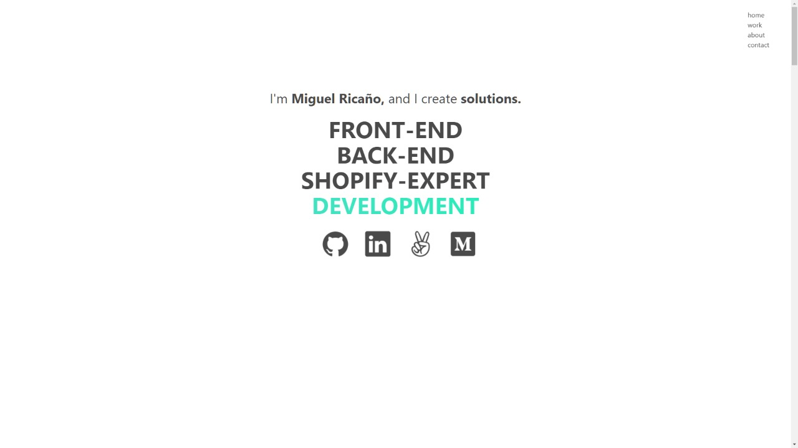

# Portfolio

This is my personal portfolio, using vanilla Javascript and HTML/CSS, with bulma as a framework.

Totally responsive.


## Live Web

[Live Web](https://miguelricano.me)

## Built With

- JavaScript
- HTML
- CSS
- Bulma

## How to start the project from your Local environment

- Open your terminal and cd where you want to store the project
- To clone the repository run the following command:
```bash
git clone https://github.com/mricanho/Portfolio.git
```
- Go to the root and select index.html, now Open the live server on your VScode `Alt + L` then `Alt + o`

## Author

👤 **Miguel Ricaño**

- Github: [@mricanho](https://github.com/mricanho)
- Linkedin: [Miguel Ricaño](https://www.linkedin.com/in/mricanho/)

## 🤝 Contributing

Contributions, issues, and feature requests are welcome!

## Show your support

Give a star if you :star: like this project!


This project is [MIT](LICENSE) licensed.